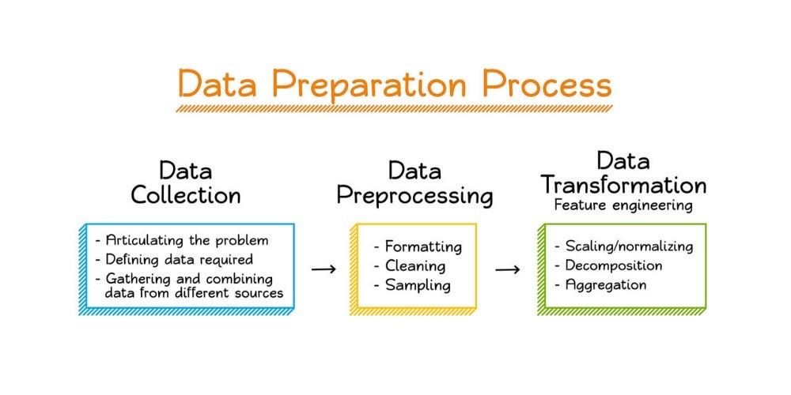
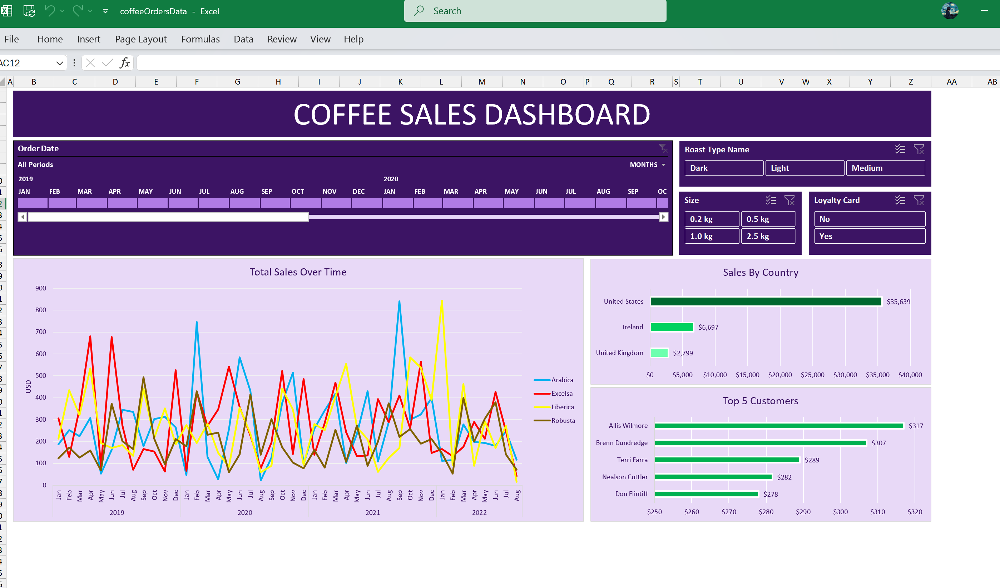

# Pushkar Gupta – Data Analytics Portfolio

Welcome to my analytics portfolio.  
I specialize in SQL, Python, and Power BI, building end-to-end analytics solutions that transform raw data into structured, decision-ready insights.

---

## 🔹 Tech Stack

- SQL Server (Data Transformation, Analytical Queries)  
- Python (pandas, matplotlib, seaborn)  
- Power BI (Power Query, Data Modeling, Advanced DAX)  
- Excel  
- Data Modeling & Analytics Workflows  

---

# 🚀 Featured Projects

---

## [1️⃣ End-to-End Marketing Analytics Pipeline](https://github.com/pushkarguptaaa/End-to-End-Marketing-Analytics-Pipeline)
**Tools:** SQL Server, Python, Power BI  

🔗 **[Live Report](https://app.powerbi.com/view?r=eyJrIjoiYWU0OTA2MDEtOWQ3OC00MzNjLThiOTctMTJmMWI1ODU3MTlkIiwidCI6IjY3YWI1OTEyLTg0YWItNGQwOS1iZTcyLWMxZDVjYzk2YTEzNCJ9)**

- Built a complete analytics workflow from raw data ingestion to dashboard reporting  
- Performed data cleaning and transformation using SQL Server  
- Conducted customer sentiment and behavioral analysis using Python  
- Designed KPI logic and reporting layer in Power BI  
- Developed a 4-page interactive dashboard (Overview, Conversion, Social Media, Customer Reviews)  
- Generated insights to support marketing performance and decision-making  

---

## [2️⃣ Advanced HR Analytics – Data Modeling & Executive Reporting](https://github.com/pushkarguptaaa/Advanced-Business-Intelligence-HR-Analytics)
**Tools:** Power BI  

🔗 **[Live Report](https://app.powerbi.com/view?r=eyJrIjoiZWViMmI5OGEtYzhiOS00NDU0LTgzNWQtZjViMWU5OWQ0YTA4IiwidCI6IjY3YWI1OTEyLTg0YWItNGQwOS1iZTcyLWMxZDVjYzk2YTEzNCJ9)**

- Transformed raw data using Power Query for analysis-ready structure  
- Designed a star schema with fact and dimension tables  
- Built optimized data model with proper relationships and date intelligence  
- Developed advanced DAX measures (YTD, YoY growth, ranking, KPIs)  
- Created interactive dashboards with drill-through, filters, and dynamic reporting  
- Delivered workforce insights aligned with business KPIs  

---

## [3️⃣ SQL Sales Analytics – Advanced Querying & Business Insights](https://github.com/pushkarguptaaa/Advanced-SQL-Sales-Performance-Analytics)
**Tools:** SQL Server  

- Performed structured data exploration across dimensions, measures, and time  
- Conducted magnitude, ranking, and performance analysis using advanced SQL queries  
- Implemented time-based analysis, including trends and cumulative metrics  
- Analysed part-to-whole contribution and customer segmentation  
- Built structured customer and product performance reports  
- Generated actionable business insights for sales performance optimisation  

---

# 📦 Additional Projects

---

## [🟡 NYC Restaurant Inspections – Data Preprocessing & Cleaning](https://github.com/pushkarguptaaa/Restaurant-Data-Preprocessing-Python-SQL)  
**Tools:** Python (pandas, sqlite3), SQL (SQLite), Jupyter  

- Collected and integrated inspection and ratings data from web scraping and APIs  
- Cleaned and standardized datasets (dates, names, price levels, ZIP codes) using Python  
- Stored structured datasets in a SQLite database for analysis  
- Performed SQL-based analysis (average scores, price impact, pass rates)  
- Exported analytical outputs to CSV for reporting and inspection

---

## [🟡 Coffee Sales Dashboard (Excel)](https://github.com/pushkarguptaaa/Excel-Coffee-Sales-Dashboard)
**Tools:** Excel  

- Built an interactive dashboard using pivot tables, charts, slicers, and timeline  
- Performed data joining using XLOOKUP and INDEX+MATCH across multiple tables  
- Created calculated metrics and applied data cleaning and formatting techniques  
- Designed a business-ready dashboard for sales performance tracking  
- Enabled dynamic filtering and analysis through interactive controls  

---

## 📊 Core Focus Areas

- End-to-end analytics workflows (data → insights → dashboards)  
- SQL-based data transformation and analysis  
- Python-driven exploratory data analysis and preprocessing  
- Designing analytics-ready data models  
- Building KPI-driven dashboards for business reporting  

---

📬 Open to Data Analyst / BI Developer opportunities  
