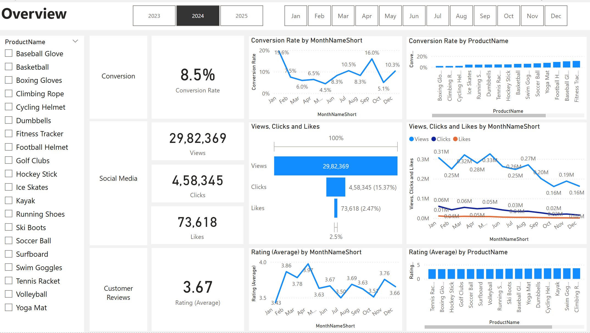
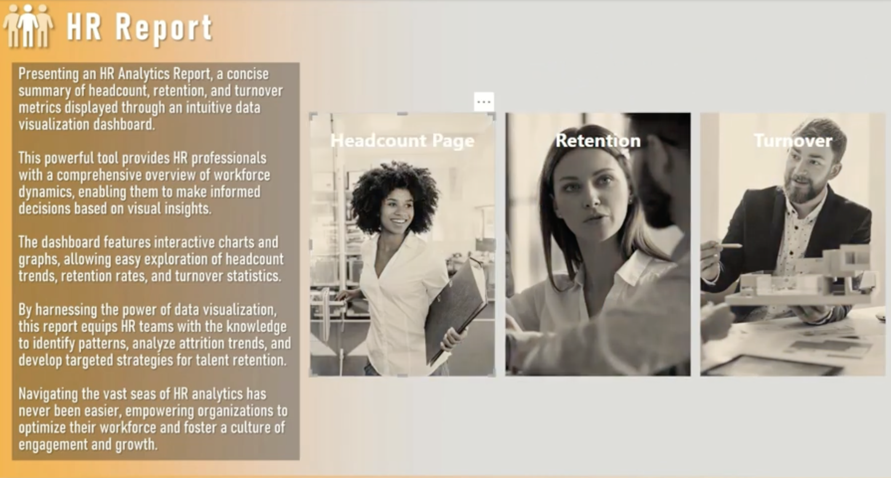
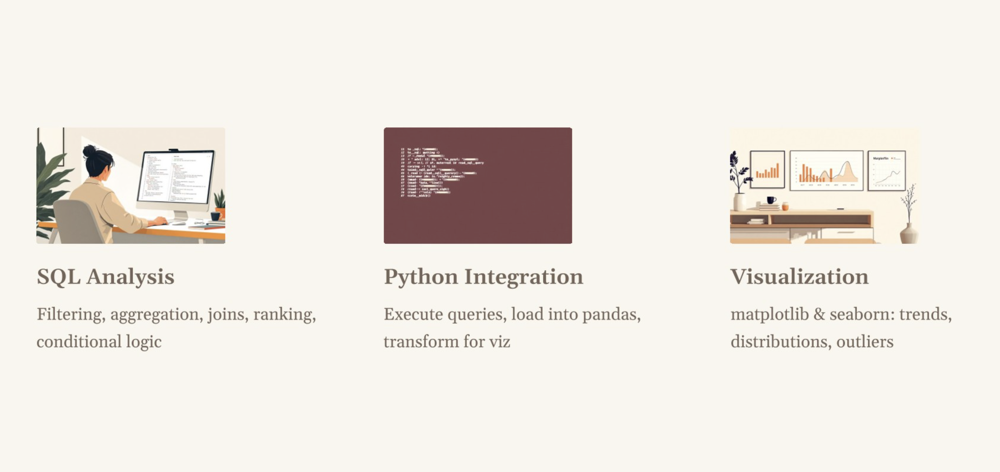

# Pushkar Gupta – Data Analytics Portfolio

Welcome to my analytics portfolio.  
I specialize in SQL, Python, and Power BI, building end-to-end analytics solutions that transform raw data into structured, decision-ready insights.

---

## 🔹 Tech Stack

- SQL Server (Data Transformation, Analytical Queries)
- Python (pandas, matplotlib, seaborn)
- Power BI (Power Query, Data Modeling, Advanced DAX)
- Excel
- Data Modeling & Analytics Workflows

---

## 🚀 Featured Projects

### [1️⃣ End-to-End Marketing Analytics Pipeline](https://github.com/pushkarguptaaa/End-to-End-Marketing-Analytics-Pipeline)
**Tools:** SQL Server, Python, Power BI  

- Built a complete analytics workflow from raw data ingestion to dashboard reporting  
- Performed data cleaning and transformation using SQL Server  
- Conducted customer sentiment and behavioral analysis using Python  
- Designed KPI logic and reporting layer in Power BI  
- Developed a 4-page interactive dashboard (Overview, Conversion, Social Media, Customer Reviews)  
- Generated insights to support marketing performance and decision-making

---

### [2️⃣ Advanced HR Analytics – Data Modeling & Executive Reporting](https://github.com/pushkarguptaaa/Advanced-Business-Intelligence-HR-Analytics)
**Tools:** Power BI  

- Transformed raw data using Power Query for analysis-ready structure  
- Designed a star schema with fact and dimension tables  
- Built optimized data model with proper relationships and date intelligence  
- Developed advanced DAX measures (YTD, YoY growth, ranking, KPIs)  
- Created interactive dashboards with drill-through, filters, and dynamic reporting  
- Delivered workforce insights aligned with business KPIs

---

### [3️⃣ SQL + Python eCommerce Analytics](https://github.com/pushkarguptaaa/SQL-Python-Hybrid-Ecommerce-Analytics)
**Tools:** SQL Server, Python, Jupyter  

- Ingested and structured raw eCommerce datasets into SQL Server using Python  
- Performed SQL-based analysis to solve business problem statements  
- Integrated SQL and Python for flexible analytical workflows  
- Conducted exploratory data analysis using pandas  
- Visualized key insights using matplotlib and seaborn  
- Identified trends in sales performance, customer behavior, and product demand

---

## 📊 Core Focus Areas

- End-to-end analytics workflows (data → insights → dashboards)  
- SQL-based data transformation and analysis  
- Python-driven exploratory data analysis and visualization  
- Designing analytics-ready data models  
- Building KPI-driven dashboards for business reporting  

---

📬 Open to Data Analyst / BI Developer opportunities
